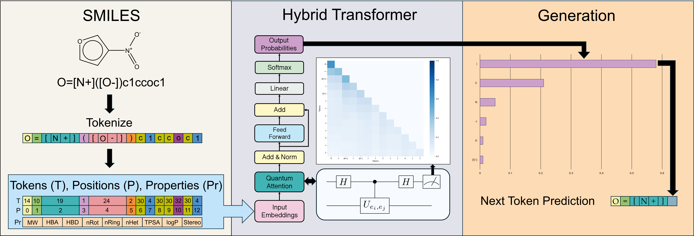

# A Hybrid Transformer Architecture with a Quantized Self-Attention Mechanism Applied to Molecular Generation.

## Summary
The success of the self-attention mechanism in classical machine learning models has inspired the development of quantum analogs aimed at reducing computational overhead. Self-attention integrates learnable query and key matrices to calculate attention scores between all pairs of tokens in a sequence that are then multiplied with a learnable value matrix to obtain the output self-attention matrix, enabling the model effectively capture long-range dependencies within the input sequence. Here, we propose a hybrid quantum-classical self-attention mechanism as part of a transformer decoder, the architecture underlying Large Language Models (LLMs). To demonstrate its utility in chemistry, we train this model on the QM9 dataset for conditional generation, providing SMILES strings as input, each labeled with a set of physicochemical properties that serve as conditions during inference. Our theoretical analysis shows that the time complexity of the query-key dot product is reduced from $\mathcal{O}(n^2 d)$ in a classical model to $\mathcal{O}(n^2\log d)$ in our quantum model, where $n$  and $d$ represent the sequence length and embedding dimension, respectively. We perform simulations using NVIDIA's CUDA-Q platform, which is designed for efficient GPU scalability. This work provides an avenue for quantum-enhanced Natural Language Processing (NLP).



The pre-print of this work can be found at [https://arxiv.org/abs/2502.19214](https://arxiv.org/abs/2502.19214). A tutorial can be found on NVIDIA's [CUDA-Q Applications page](https://nvidia.github.io/cuda-quantum/latest/applications/python/quantum_transformer.html).
## Installation

To reproduce the results from this repository, you can set up your environment using **Conda** or **pip**.

First, clone the repository:
```sh
git clone https://github.com/anthonysmaldone/Quantum-Transformer.git
cd Quantum-Transformer
```
### Using Conda (recommended for Perlmutter jobs):
```sh
conda env create -f cuda_quantum_transformer_env.yml
conda activate cuda_quantum_transformer_env
```

### Using Pip
```sh
pip install cudaq==0.9.1 rdkit==2024.9.4 torch==2.5.1+cu121 torchvision torchaudio \
    --index-url https://download.pytorch.org/whl/cu121 \
    pandas==2.2.2 torchdata==0.10.1 tqdm==4.67.1 \
    scikit-learn==1.5.1 seaborn==0.13.2 gdown==5.2.0
```
## Reproducing Results & Figures

This repository provides a script, `reproduce.py`, to facilitate the reproduction of key results from the paper, including model training, figure generation, and inference.

The trained checkpoint files for the best and last (20th) epoch for each models are located in `model_checkpoints/`. The figures and inference reproducability functions uses these models to recreate the data from the paper.

### **1. Generate Figures**
To generate figures used in the paper, use the --figures flag.
```sh
python reproduce.py --figures
```
No additional options are required.


### **2. Run Inference**
To perform inference on a trained model, use the `--inference-results` flag along with the required `--model` and `--mode options`.
```sh
python reproduce.py --inference-results --model <MODEL_TYPE> --mode <MODE>
```
Model Options (--model)
- quantum – Train the quantum model.
- classical_eq – Train the classical equivalent model.
- classical – Train the standard classical model.
  
Training Mode Options (--mode)
- sequence – Train using sequence-only data.
- conditions – Train using both sequence and condition data.

Examples
- Run inference on the pre-trained quantum model with SMILES data only:
```sh
python reproduce.py --inference-results --model classical --mode sequence
```
- Run inference on the pre-trained classical model with SMILES and physicochemical properties:
```sh
python reproduce.py --inference-results --model quantum --mode conditions
```

### **3. Train Models**
To re-train a model, use the `--train-models` flag along with the required `--model` and `--mode` options as explain above.

```sh
python reproduce.py --train-models --model <MODEL_TYPE> --mode <MODE>
```

#### **Note**: These models were trained on Perlmutter using 4 NVIDIA A100 GPUs, and exact numerical reproducability is not garunteed across hardware architectures. Thus, results may slightly differ when running inference and training reproducability functions. 


## Usage
A notebook tutorial can be found here (coming soon) and documentation on available functions can be found in `docs/`.

If using Perlmutter or a SLURM-based cluster, the following example job script ensures the highest level of performance currently supported (1 node, 4 GPUs):

```sh
#!/bin/bash
#SBATCH -N 1                       # Use 1 node
#SBATCH --ntasks-per-node=1        # Run a single task
#SBATCH --gpus-per-task=4          # Use 4 GPUs for the task
#SBATCH -t 48:00:00                # Max runtime
#SBATCH -q regular                 # Queue
#SBATCH -A replace_with_account    # Allocation account
#SBATCH -C gpu                     # Use GPU nodes

# Load Conda module
module load conda

# Activate your Conda environment
conda activate cuda_quantum_transformer_env

# Run the Python script
python my_example_script.py
```

Save the above script and submit the job:
```sh
sbatch quantum_transformer_example_job.sh
```